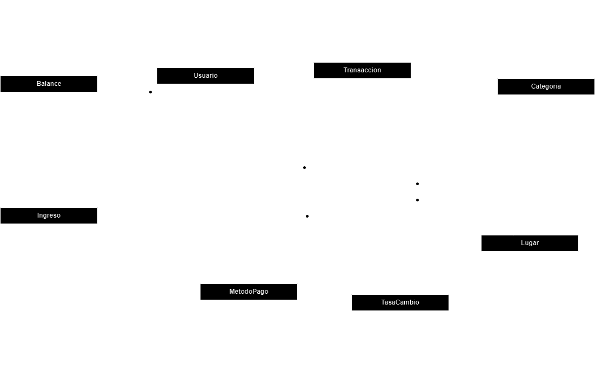

# Documentación de la API Rest de Control Gastos con .NET Core C#

Bienvenido a la documentación de la API Rest de Control Gastos. Esta API proporciona funcionalidades para administrar gastos personales.

## Diagrama Módelo Relacional




## Instalación y Requisitos

Para utilizar esta API, asegúrate de tener instalado:

- .NET Core SDK
- Visual Studio 2022 o Visual Studio Code
- SQL Server

## Autenticación

La API utiliza autenticación basada en tokens JWT (JSON Web Token). Para acceder a los endpoints protegidos, debes incluir el token de acceso en el encabezado de autorización de la solicitud HTTP.

## Endpoints

### 1. Registro de usuario

#### Descripción

Este endpoint permite registrar un nuevo usuario en el sistema.

#### Método HTTP

`POST`

#### Ruta
`/api/Authentication/register`

#### Cuerpo de la solicitud

```json
{
  "password": "string",
  "correo": "string",
  "primerNombre": "string",
  "segundoNombre": "string"
}
```
#### Códigos de respuesta

- `200 ok`: El usuario se ha registrado correctamente.
- `400 Bad Request`: La solicitud contiene datos inválidos.
- `409 Conflict`: El correo electrónico ya está en uso.
- `500 Internal Server Error`: Error interno del servidor.

### 2. Login

#### Descripción

Este endpoint permite que un usuario registrado inicie sesión en la aplicación.

#### Método HTTP

`POST`

#### Ruta
`/api/Authenticacion/login`

#### Cuerpo de la solicitud

```json
{
  "correo": "string",
  "password": "string"
}
```
#### Códigos de respuesta

- `200 ok`: El usuario se ha logueado correctamente.
- `400 Bad Request`: La solicitud contiene datos inválidos.
- `401 Unauthorized`: Las credenciales proporcionadas son incorrectas..
- `500 Internal Server Error`: Error interno del servidor.

## Balance

El balance representa el saldo actual en la cuenta del usuario, reflejando tanto los ingresos como los gastos registrados a través de movimientos financieros. Este saldo puede fluctuar a medida que se añaden nuevos ingresos o se realizan gastos, reflejando así la situación financiera en tiempo real.

## Endpoints

### Obtener Balance

#### Descripción

Este endpoint permite obtener el balance actual del usuario logueado.

#### Método HTTP

`GET`

#### Ruta
`/api/Balance`

#### Parámetros de consulta

- `idUsuario`: ID del usuario para el cual se obtiene el balance. Este parámetro se utiliza para especificar el usuario del cual se desea conocer el saldo. El backend utilizará automáticamente el usuario actualmente autenticado, extrayendo la información del token de autenticación.

#### Códigos de respuesta

- `200 OK`: La solicitud se completó satisfactoriamente.
- `401 Unauthorized`: No se proporcionaron credenciales de autenticación válidas.
- `404 Not Found`: El balance para el usuario no pudo ser encontrado.
- `500 Internal Server Error`: Error interno del servidor.


## Ingresos

Esta funcionalidad te permite registrar tus ingresos para llevar un control detallado de tus finanzas.

## Endpoints

### 1. Obtener Ingresos por mes

#### Descripción

Este endpoint te permite obtener los ingresos registrados para el mes actual o para una fecha específica proporcionada.

#### Método HTTP

`GET`

#### Ruta
`/api/Ingresos`

#### Parámetros de consulta

- `mes`: Especifica el mes para el cual deseas obtener los ingresos. Este parámetro debe ser proporcionado en formato de fecha y hora (datetime)
- `idUsuario`: ID del usuario para el cual se obtiene los ingresos por Usuario. Este parámetro se utiliza para especificar el usuario del cual se desea conocer el saldo. El backend utilizará automáticamente el usuario actualmente autenticado, extrayendo la información del token de autenticación.

#### Códigos de respuesta

- `200 OK`: La solicitud se completó satisfactoriamente.
- `401 Unauthorized`: No se proporcionaron credenciales de autenticación válidas.
- `500 Internal Server Error`: Error interno del servidor.


### 2. Registrar Ingresos

#### Descripción

Este endpoint te permite registrar los ingresos en tu cuenta para llevar un seguimiento preciso de tus finanzas.

#### Método HTTP

`POST`

#### Ruta
`/api/Ingresos`

#### Parámetros de consulta

- `idUsuario`: Este parámetro se utiliza para especificar el usuario del cual se desea conocer el saldo. El backend utilizará automáticamente el usuario actualmente autenticado, extrayendo la información del token de autenticación.
- `idBalance`:  Si el usuario no tiene un balance asociado, al realizar la solicitud de registro de ingreso, se creará automáticamente un balance para el usuario.
- `idIngreso`:  Este identificador se genera automáticamente en el backend como un GUID único para cada ingreso registrado.


- #### Cuerpo de la solicitud

```json
{
  "monto": 0,
  "fechaIngreso": "2024-03-10",
  "descripcion": "string"
}
```

#### Códigos de respuesta

- `200 OK`: La solicitud se completó satisfactoriamente.
- `401 Unauthorized`: No se proporcionaron credenciales de autenticación válidas.
- `500 Internal Server Error`: Error interno del servidor.


## Transacción (Gastos)

Esta funcionalidad te permite registrar y consultar tus gastos/Transacciones para llevar un control detallado de tus finanzas.

## Endpoints

### 1. Obtener Transacción por mes

#### Descripción

Este endpoint te permite obtener las transacciones registrados para el mes actual o para una fecha específica proporcionada.

#### Método HTTP

`GET`

#### Ruta
`/api/Transaccion`

#### Parámetros de consulta

- `mes`: Especifica el mes para el cual deseas obtener las transacciones. Este parámetro debe ser proporcionado en formato de fecha y hora (datetime)
- `idUsuario`: ID del usuario para el cual se obtiene las transacciones por Usuario. Este parámetro se utiliza para especificar el usuario del cual se desea conocer el saldo. El backend utilizará automáticamente el usuario actualmente autenticado, extrayendo la información del token de autenticación.

#### Códigos de respuesta

- `200 OK`: La solicitud se completó satisfactoriamente.
- `401 Unauthorized`: No se proporcionaron credenciales de autenticación válidas.
- `500 Internal Server Error`: Error interno del servidor.


### 2. Registrar Transacciones

#### Descripción

Este endpoint te permite registrar las transacciones en tu cuenta para llevar un seguimiento preciso de tus finanzas.

#### Método HTTP

`POST`

#### Ruta
`/api/Transaccion`

#### Parámetros de consulta

- `idUsuario`: Este parámetro se utiliza para especificar el usuario del cual se desea conocer el saldo. El backend utilizará automáticamente el usuario actualmente autenticado, extrayendo la información del token de autenticación.
- `idTransaccion`:  Este identificador se genera automáticamente en el backend como un GUID único para cada transaccón registrada.


- #### Cuerpo de la solicitud

```json
{
  "idCategoria": "3fa85f64-5717-4562-b3fc-2c963f66afa6",
  "idLugar": "3fa85f64-5717-4562-b3fc-2c963f66afa6",
  "idMetodoPago": "3fa85f64-5717-4562-b3fc-2c963f66afa6",
  "descripcion": "string",
  "producto": "string",
  "monto": 0,
  "fechaTransaccion": "2024-03-10T04:03:50.323Z",
}
```

#### Códigos de respuesta

- `200 OK`: La solicitud se completó satisfactoriamente.
- `401 Unauthorized`: No se proporcionaron credenciales de autenticación válidas.
- `500 Internal Server Error`: Error interno del servidor.

# CRUDs
## Categoria

Esta funcionalidad te permite hacer el CRUD de categorias.

## Endpoints

### 1. Obtener Categorias

#### Descripción

Este endpoint te permite obtener las categorias registradas.

#### Método HTTP

`GET`

#### Ruta
`/api/Categoria`


#### Códigos de respuesta

- `200 OK`: La solicitud se completó satisfactoriamente.
- `401 Unauthorized`: No se proporcionaron credenciales de autenticación válidas.
- `500 Internal Server Error`: Error interno del servidor.


### 2. Registrar Categoría

#### Descripción

Este endpoint te permite registrar las Categorias.

#### Método HTTP

`POST`

#### Ruta
`/api/Categoria`


- #### Cuerpo de la solicitud

- `IdCategoria`:  Este identificador se genera automáticamente en el backend como un GUID único para cada categoria que se registra.

```json
{
  "idCategoria": "3fa85f64-5717-4562-b3fc-2c963f66afa6",
  "nombreCategoria": "string",
  "icono": "string",
  "color": "string"
}
```

#### Códigos de respuesta

- `200 OK`: La solicitud se completó satisfactoriamente.
- `401 Unauthorized`: No se proporcionaron credenciales de autenticación válidas.
- `500 Internal Server Error`: Error interno del servidor.

### 3. Actualizar Categoría

#### Descripción

Este endpoint permite actualizar la información de una categoría existente.

#### Método HTTP

`PUT`

#### Ruta
`/api/Categoria`


- #### Cuerpo de la solicitud

- `IdCategoria`:  El identificador de la categoría se proporciona dentro del objeto "Categoría"

```json
{
  "idCategoria": "3fa85f64-5717-4562-b3fc-2c963f66afa6",
  "nombreCategoria": "string",
  "icono": "string",
  "color": "string"
}
```

#### Códigos de respuesta

- `200 OK`: La solicitud se completó satisfactoriamente.
- `401 Unauthorized`: No se proporcionaron credenciales de autenticación válidas.
- `500 Internal Server Error`: Error interno del servidor.

-----

## Lugar

Esta funcionalidad te permite hacer el CRUD de Lugar.

## Endpoints

### 1. Obtener Lugar

#### Descripción

Este endpoint te permite obtener los Lugares registradas.

#### Método HTTP

`GET`

#### Ruta
`/api/Lugar`


#### Códigos de respuesta

- `200 OK`: La solicitud se completó satisfactoriamente.
- `401 Unauthorized`: No se proporcionaron credenciales de autenticación válidas.
- `500 Internal Server Error`: Error interno del servidor.


### 2. Registrar Lugar

#### Descripción

Este endpoint te permite registrar el Lugar.

#### Método HTTP

`POST`

#### Ruta
`/api/Lugar`


- #### Cuerpo de la solicitud

- `idLugar`:  Este identificador se genera automáticamente en el backend como un GUID único.

```json
{
  "idLugar": "3fa85f64-5717-4562-b3fc-2c963f66afa6",
  "nombreLugar": "string"
}
```

#### Códigos de respuesta

- `200 OK`: La solicitud se completó satisfactoriamente.
- `401 Unauthorized`: No se proporcionaron credenciales de autenticación válidas.
- `500 Internal Server Error`: Error interno del servidor.

### 3. Actualizar Lugar

#### Descripción

Este endpoint permite actualizar la información de un Lugar existente.

#### Método HTTP

`PUT`

#### Ruta
`/api/Lugar`


- #### Cuerpo de la solicitud

- `idLugar`:  El identificador del Lugar se proporciona dentro del objeto "Lugar"

```json
{
  "idLugar": "3fa85f64-5717-4562-b3fc-2c963f66afa6",
  "nombreLugar": "string"
}
```

#### Códigos de respuesta

- `200 OK`: La solicitud se completó satisfactoriamente.
- `401 Unauthorized`: No se proporcionaron credenciales de autenticación válidas.
- `500 Internal Server Error`: Error interno del servidor.


-----

## Método de Pago

Esta funcionalidad te permite hacer el CRUD de Método de pago.

## Endpoints

### 1. Obtener Método de pago

#### Descripción

Este endpoint te permite obtener los Metodos de pagos registradas.

#### Método HTTP

`GET`

#### Ruta
`/api/MetodoPago`


#### Códigos de respuesta

- `200 OK`: La solicitud se completó satisfactoriamente.
- `401 Unauthorized`: No se proporcionaron credenciales de autenticación válidas.
- `500 Internal Server Error`: Error interno del servidor.


### 2. Registrar Método de pago

#### Descripción

Este endpoint te permite registrar el Método de pago.

#### Método HTTP

`POST`

#### Ruta
`/api/MetodoPago`


- #### Cuerpo de la solicitud

- `idMetodoPago`:  Este identificador se genera automáticamente en el backend como un GUID único.

```json
{
  "idMetodoPago": "3fa85f64-5717-4562-b3fc-2c963f66afa6",
  "descripcion": "string"
}
```

#### Códigos de respuesta

- `200 OK`: La solicitud se completó satisfactoriamente.
- `401 Unauthorized`: No se proporcionaron credenciales de autenticación válidas.
- `500 Internal Server Error`: Error interno del servidor.

### 3. Actualizar Método Pago

#### Descripción

Este endpoint permite actualizar la información de un Método Pago existente.

#### Método HTTP

`PUT`

#### Ruta
`/api/MetodoPago`


- #### Cuerpo de la solicitud

- `idMetodoPago`:  El identificador del Método de pago se proporciona dentro del objeto "MetodoPago"

```json
{
  "idMetodoPago": "3fa85f64-5717-4562-b3fc-2c963f66afa6",
  "descripcion": "string"
}
```

#### Códigos de respuesta

- `200 OK`: La solicitud se completó satisfactoriamente.
- `401 Unauthorized`: No se proporcionaron credenciales de autenticación válidas.
- `500 Internal Server Error`: Error interno del servidor.
